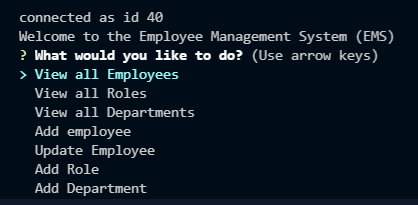

# homework-12-employee-tracker-content-management-system

## Description
This is a command line app that allows the user to access a local SQL database for their company. They can record the names of employees, various details, and update those employees as well. Functionality for deletion of roles coming later. 

## Video Demonstration

https://drive.google.com/file/d/1gsAuu3WT_EeQZvi6w5BnxvKc63rHmcoZ/view

## Operations
1. This is a command line app that runs in your code reader or shell. You must first clone into the repo to utilize the app.
2. Initialize and install npm packages (dependencies in package.json)
3. <mysql -u root -p> <SOURCE ./db/schema.sql> <SOURCE ./db/seeds.sql>
4. <npm start>
5. Choose which function you would like to perform inckluding: view employees, view departments, update employees, update roles, etc.
6. After each command is executed you will be prompted to continue. Select 'NO' to close the app.

## Tech/Framework
Built with:
    * HTML
    * CSS
    * JavaScript
    * SQL
    * Express.js
    * NPM: inquirer, fs, express, mysql, console.table
    * Node.js

## Authors and Acknowledgment
* Nick Skinner
* I'd like to thank the UC Davis coding bootcamp team for answering all my questions regarding this project.

## Known Bugs

## License
Copyright [2021] [##Authors]

Licensed under the Apache License, Version 2.0 (the "License");
you may not use this file except in compliance with the License.
You may obtain a copy of the License at

    http://www.apache.org/licenses/LICENSE-2.0

Unless required by applicable law or agreed to in writing, software
distributed under the License is distributed on an "AS IS" BASIS,
WITHOUT WARRANTIES OR CONDITIONS OF ANY KIND, either express or implied.
See the License for the specific language governing permissions and
limitations under the License.